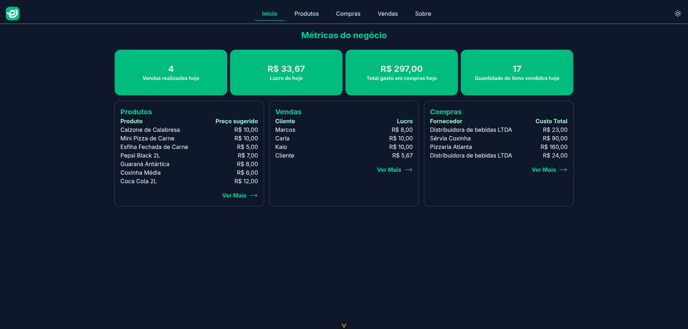

# Controle de inventório

Essa é uma aplicação web para controle de estoque, com compra e venda de produtos.


## Stack
- Backend: PHP
- Frontend: Vue.js
- Infra: Docker + Nginx

## Pré-requisitos
- Docker

## Como rodar

1. Clone o repositório
```bash
git clone https://github.com/gabrielcavdias/inventory-control
cd [pasta-do-projeto]
```

2. Suba os containers 
```bash
docker-compose up -d
```

3. Acesse a aplicação

- Frontend: http://localhost:5173

- API: http://localhost:8010